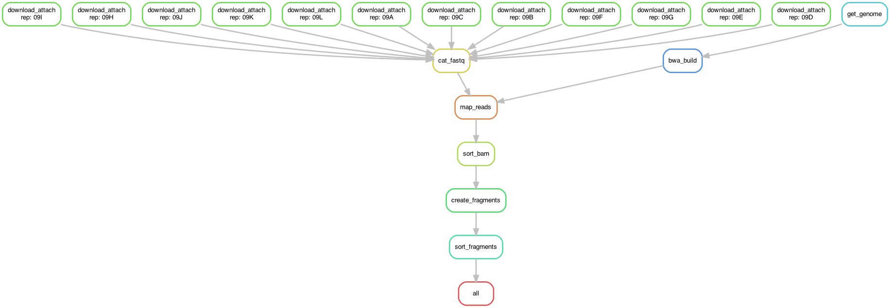

# SNARE-seq

Code to process raw SNARE-seq ATAC reads for the adult mouse brain.

Steps:

1. Download fastq files from SRA for each replicate (12 replicates)
2. Attach cell barcode and replicate prefix to fastq read name using sinto
3. Download mm10 genome fasta from UCSC and create bwa index
4. Map fastq files to mm10 using bwa mem, pipe output to samtools to create bam file
5. Sort and index bam file with samtools
6. Create fragment file from bam file using sinto
7. Sort, bgzip-compress, and index fragment file using bgzip and tabix

The pipeline is constructed using snakemake. To run the pipeline, first 
install miniconda, then create a conda environment for the pipeline using
the environment.yaml file. This will install all the dependencies needed:

```
conda env create -f environment.yaml
```

This creates an environment called `snareseq`. Activate this environment when running the
pipeline: `conda activate snareseq`.

You can execute a dry-run of the pipeline to see what steps will be run using:
`snakemake -n`

To run the pipeline and generate the outputs, run:

```
snakemake --cores 8
```

Note that this involves >500 Gb of raw data.

Overview of the pipeline:


